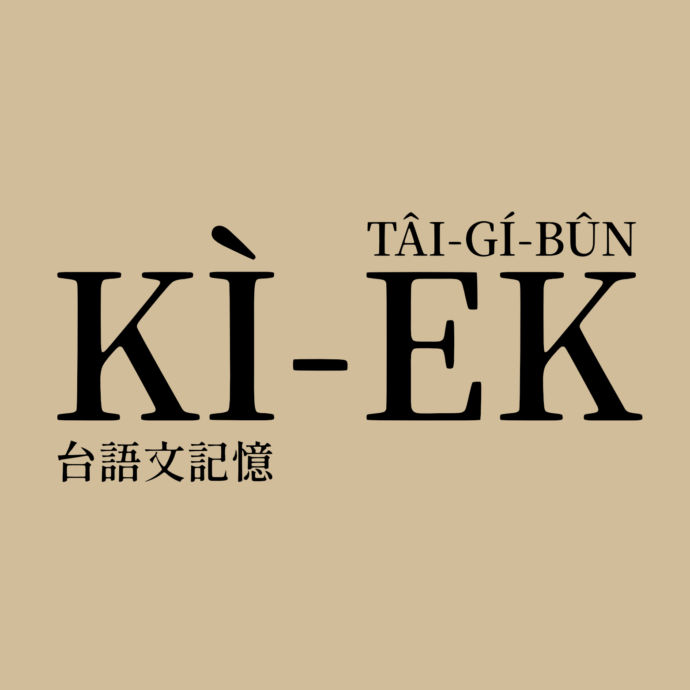

## 紹介「台語文記憶」

「台語文記憶」收錄台語文豐富ê文獻資料，是咱台灣人寶貴ê記憶！

「台語文記憶」原始網站（2000~2023）是楊允言教授起--ê，i長期替台灣人收集、公開chiah ê台語文獻，是世間siōng齊全--ê，特別感謝--i。

楊允言教授自2024年起將「台語文記憶」所有ê資料，授權hō͘打狗台語文促進協會「台文雞絲麵 Tâi-bûn Ke-si Mī」專案來維護管理，利便大家利用chiah ê資料，學習、研究台語文。

### 特色
- 資料上豐富
  - 收集台語文資料siōng齊全，ùi清國時代、日本時代，kàu戰後，是台語文獻ê大金庫！
- 文獻真多元
  - 內底收錄--ê，lóng是hâm台語相關ê資料，有用日文寫--ê、英文寫--ê、白話字寫--ê、漢字寫--ê等等。
- 種類百百款
  - 整理各種資料，有辭典、課本、刊物、報紙、作品、冊等等文獻，有醫學--ê、數學--ê、地理--ê等等無kāng領域--ê。有詩、歌、散文、小說、劇本等等無kāng文體--ê。

### Kā阮支持

目前chit ê網站單單óa靠「台文雞絲麵 Tâi-bûn Ke-si Mī」專案teh經營，nā有siáⁿ-mih問題a̍h是建議，網站下底有聯絡方式，歡迎kap阮聯絡。Beh管理維護需要真chē人力kap時間，為tio̍h維持咱寶貴ê語文資產，請kā阮<a href="https://linktr.ee/taibunkesimi">贊助支持！</a>
{: .notice--warning}

## 楊允言教授ê話

## 原網站紹介（中文）

### 一、計畫緣起

雖然美國的歷史不長，美國的國會圖書館執行了一項名為 <a href="http://memory.loc.gov/">美國記憶</a> 的計畫，要將許多與美國相關的資料數位化。

台灣也受到這個影響，2002年起，國科會開始了「<a href="http://www.ndap.org.tw/">數位典藏國家型計畫</a>」，也開始把有台灣特色的相關事物數位化。第一個五年期計畫於2006年結束，2007年又開始第二個五年計畫。除此外，國家圖書館也執行了「<a href="https://tm.ncl.edu.tw/">台灣記憶</a>」計畫。

受到上述計畫的啟發，我們也希望能將台語文發展的軌跡，透過「台語文記憶」這樣的計畫來紀錄。我們曾經與相關政府單位洽談此計畫，但是有的單位興趣缺缺，有的單位覺得我們掌握到的資料許多不是原本而是影本，以致認為沒有典藏價值。

不過，做這件事其實不必等，愈早開始愈好。

### 二、發起人

楊允言

### 三、計畫經費

2008年大漢技術學院補助新台幣六萬元。其它的自己想辦法。

### 四、計畫目標

「台語文記憶」從2007/6正式上線。

我們的理念是：台語文資料，除了當成個人收藏品外，還可以是台灣人的公共財。本站的資料都可無償使用，若要使用，請註明「引用自『台語文記憶』計畫網站」，並請註明網址（<a href="http://ip194097.ntcu.edu.tw/Memory/TGB">http://ip194097.ntcu.edu.tw/Memory/TGB</a>）。

### 五、尋求支援

因為沒有經費支持，沒有聘請助理，所有工作都是參與者利用時間一點一滴做出來。我們需要的支援包括：

- 資料提供：如果您有相關資料願意提供，請與楊允言聯絡。
- 技術支援：影像的zoom in/out，採用 moozoom。如果有更好的展示技術，歡迎來信討論。
- 意見回應：告訴我們有哪些需要改進的地方，也許我們的動作不會很快，但是我們會盡力把網站做的更好、更方便使用。
- 經費支援：......暫時還沒想到要怎麼做比較好。不過如果有經費，會繼續用在資料整理和蒐集上。
